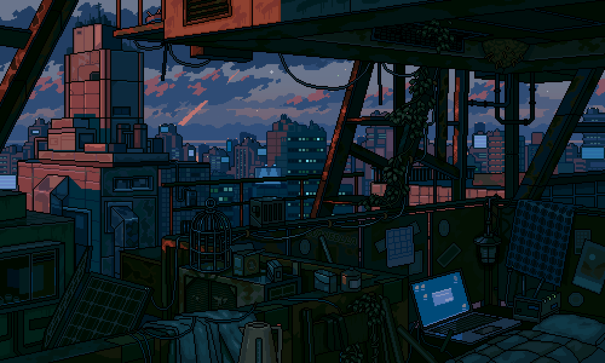
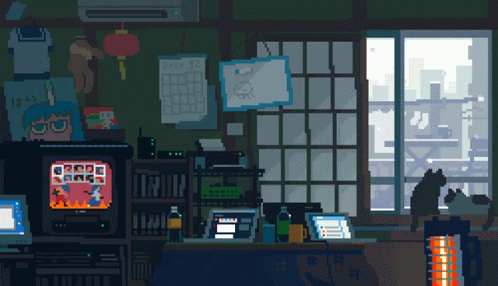
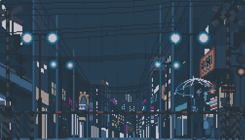

<!-- MasterHead Banner -->

  

    

  <h1>idoblink</h1>
  <h3>Dhanush H S</h3>
  
AI &amp; Machine Learning Engineering · Systems Software · Full-Stack Architecture

<!-- Profile Views -->

  

 

<!-- About Me Section with Pixel Art Scene -->

### About Me

  - Computer Science &amp; Engineering Undergrad (AI/ML) at <b>Vidyavardhaka College of Engineering</b>, Karnataka, India. 
  - Building end-to-end systems across <b>Machine Learning</b>, <b>Full-Stack Web</b>, and <b>Native Windows Software</b>. 
  - Engineering deep learning pipelines (<b>PyTorch</b>, <b>YOLOv8</b>, <b>Audio-Visual Separation</b>) and native system utilities (<b>C# / Win32</b>). 
  - Focus areas: Machine Learning Systems, Computer Vision, High-Performance Backends, and Process Architecture. 
  - Focused on shipping tested, deployable code with containerized infrastructure and automated testing.

  <b>Connect:</b>&nbsp;
  
  
  

 
 

<!-- Languages & Tools -->
<h3 align="center">Languages &amp; Tools</h3>

   
   
   

 

<!-- GitHub Stats -->
<h3 align="center">GitHub Stats</h3>

  
  
   
  

 

<!-- Tech Stack Badges -->
<h3 align="center">Tech Stack</h3>

  <!-- Languages -->
  
  
  
  
  
  

   

  <!-- AI / ML -->
  
  
  
  
  

   

  <!-- Web & Systems -->
  
  
  
  
  
  
  

 

<!-- Featured Systems (2-Column Grid, Quote Removed) -->
<h3 align="center">Featured Systems</h3>
<table align="center" border="0" width="100%">
  <tr>
    <td align="center" width="50%" valign="top">
      

         
         
        
      

    </td>
    <td align="center" width="50%" valign="top">
      

         
         
        
      

    </td>
  </tr>
</table>

 

<!-- Support -->
<h3 align="center">Support</h3>

  

 

<!-- Bottom Pixel Art Banner -->

  
    
  Dhanush H S · idoblink

